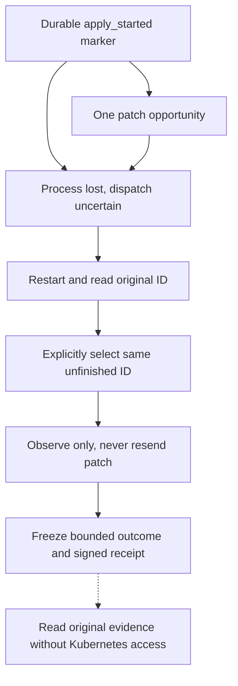

# Kapsel service operator guide

Status: unreleased preview preparation path. Native installed-artifact and live-journey
qualification remain required. No published service artifact or production support is implied.

The operator prepares exact approvals and private execution material. A separate caller can select
an approved ID and retrieve its evidence, but cannot change authority or control the service. The
[service contract](KAPSEL_SERVICE.md) owns fixed paths, identities and process lifecycle.

## Candidate requirements

The commands below describe current source, not every archive named `0.3.0-preview.1`. Identify an
archive by its exact source revision and SHA-256, not the package version alone.

The executable walkthrough below uses a clean local build from source revision
`95794b84bd2e21d658c3525f9987873a2ed1a458`, archive SHA-256
`b2c83a2ab540592531ef7a0fb5b6884c1d3d1305efe2231b8c0aa72fda32f285`. These are unpublished, unsigned
local bytes, not an authenticated release. This guide adds examples to the documentation bundled at
that revision without changing its binaries or verifier companion.

Earlier preview archives can lack `prepare-service-config`, `validate-service-config`, narrated
example output or the retained example trust file. Do not mix an archive with a newer verifier
companion. Accept the complete matching archive and sidecars at an exact revision. No preview
download or native qualification of these new bytes is implied.

## One-command disposable example

This is the shortest path from an extracted release's production binaries to an inspected receipt.
It runs the real systemd service with separate operator, service and caller identities. A bounded
loopback HTTP fixture supplies Kubernetes observations, so no cluster or cloud credentials are
needed. It demonstrates the mechanism, not a live Deployment rollout or production readiness.

Use a **fresh disposable native x86-64 Debian 12 VM** with systemd as PID 1, Python 3.11+,
sudo/root, `systemd-sysusers`, `systemd-analyze`, `journalctl`, `useradd` and GNU coreutils. It must
have no existing Kapsel identities, installation or state. Do not clear existing state to make the
example run. Docker and ARM emulation do not satisfy this native example's prerequisites.

Obtain the archive and its four companions using the
[authenticated preparation route](RELEASE.md#authenticate-and-extract-the-preview). Keep all five
files together. For an unsigned local build, independently record its exact source and archive
digests and transfer it through a trusted channel. That is not publisher authentication.

Set `archive` to that local archive and `revision` to the independently accepted 40-character source
revision. Then one command extracts, prepares, starts, submits, inspects and stops the example:

```sh
sudo python3 "$archive.verify.py" --archive "$archive" --expected-revision "$revision" --service-systemd
```

This explicitly authorizes installation and activation **inside the disposable VM only**. The
existing artifact verifier owns the example and its checks. There is no separate demo executable or
source checkout to install.

The command shows each meaningful action:

1. Install the extracted binaries and shipped unit under distinct service/caller identities.
2. Deliberately start without an operator document. Confirm the service fails closed and journald
   reports `provisioning_unavailable`. Show the supported diagnosis commands.
3. Prepare a real signed snapshot grant from the fixture's target, then prepare and cold-publish the
   operator document. All keys and approval inputs are disposable fixture authority, never defaults
   for a real deployment.
4. Start with systemd, read stored history, and submit `artifact-op-1` through the packaged client.
   `ADMITTED` confirms durable admission, not receiver success.
5. Read `SUCCEEDED`, export the receipt and inspect it with the packaged `kapsel inspect` command.
   `INSPECTED` authenticates the frozen evidence under separately appointed fixture trust.
6. Stop, replace the cold catalog, restart read-first and retrieve the byte-identical receipt. The
   fixture must count exactly one PATCH. Finish with the unit stopped and disabled.

After a successful run you can inspect the retained receipt again:

```sh
sudo /usr/bin/kapsel inspect --receipt /tmp/kapsel-artifact-receipt-0 \
  --trust /etc/kapsel/example-receipt.trust --evaluation-time-unix-s 150
```

The time `150` belongs only to the deliberately artificial fixture trust window. It is not a current
trust evaluation for a real receipt. The fixture is gone when the command returns. Do not restart
this installation as a real service.

Success retains private state, fixture authority, installed assets, identities and both receipt
exports for inspection. Failure may leave partial installation or incomplete retirement. Do not
rerun by deleting history. Preserve the VM until the evidence has been collected, then retire the
whole disposable VM rather than deleting individual journal files. The
[native qualification contract](RELEASE.md#native-installed-systemd-qualification) owns the exact
host footprint and evidence requirements.

## Captured first action and same-ID recovery

Follow the [canonical input](#canonical-deployment-image-example),
[key generation](#generate-disposable-keys-and-inspection-trust) and
[preparation commands](#read-the-snapshot-sign-and-assemble-configuration) below. This captured
fixture example shows the operator repairing missing receipt-signing material and the caller
resuming the original ID. It is not a live Kubernetes rollout. Do not withhold material from a
service that owns real work just to reproduce this failure.

Preparation printed these three JSON lines:

```text
{"command":"provision-snapshot-grant","status":"PROVISIONED"}
{"command":"prepare-service-config","status":"PREPARED"}
{"command":"validate-service-config","status":"VALIDATED_STATIC"}
```

The prepared document was checked against the freshly generated public key and exact signed grant.
Its structure is shown with those variable values redacted, **not as a loadable configuration**:

```json
{
  "service_configuration_version": 1,
  "authorization_keys": [
    { "key_id": "approval-key-1", "public_key_hex": "<generated approval.pub encoded as hex>" }
  ],
  "approvals": [
    {
      "label": "Approved image for agent-api",
      "signed_grant_hex": "<generated approval.grant encoded as hex>"
    }
  ],
  "receipt_signing_key_id": "receipt-key-1"
}
```

Cold publication returned `PUBLISHED`. `list` returned `artifact-op-1`, its approved image and
snapshot `artifact-deployment-uid` / resourceVersion `1`. Initial `history` was empty. Neither read
contacted the receiver. After `submit artifact-op-1`, the exact admission response was:

<!-- example-admitted -->

```json
{ "version": 1, "status": "ADMITTED", "phase": "requested" }
```

`status artifact-op-1` then returned `IN_PROGRESS` after one PATCH and frozen rollout observations.
Its execution field was:

<!-- example-signing -->

```json
{
  "action_owner": "operator",
  "condition": "signing_unavailable",
  "disposition": "operator_required",
  "next_action": "contact_operator"
}
```

The operator stopped gracefully, restored the intended `receipt.seed` under its original custody and
restarted. Reading the **same ID before submission** still returned `IN_PROGRESS`, now with:

<!-- example-resume -->

```json
{
  "action_owner": "caller",
  "condition": null,
  "disposition": "resume_required",
  "next_action": "select_same_id"
}
```

The restart did not contact the receiver. `submit artifact-op-1` then returned:

<!-- example-readmitted -->

```json
{ "version": 1, "status": "ADMITTED", "phase": "receiver_observed" }
```

Subsequent status was `SUCCEEDED`, with `execution.next_action: "inspect_result"`. Receipt export
returned `READY` with a SHA-256 and the new caller-owned path. Inspection under the independently
appointed `receipt.trust` returned `INSPECTED`, `operation_id: "artifact-op-1"` and
`result: "SUCCEEDED"`. Random keys make the grant and receipt digests differ between runs.

The fixture counted one PATCH. Restoring the intended signer completed the already frozen evidence,
so same-ID resumption sent no new receiver requests. See [validation](#validation) for reproduction
and the limits of this evidence.

## Prepare your own extracted artifact

The following steps are for operator-owned authority and a real receiver, not the disposable example
above.

Use one fresh, disposable native x86-64 Debian 12 host with systemd, Python 3.11, OpenSSL, sudo and
standard account tools. Artifact preparation additionally requires Cosign 3.1.2 and GNU `sha256sum`.
Follow [Authenticate and extract the preview](RELEASE.md#authenticate-and-extract-the-preview) using
its checksum-bound verifier companion and Python 3.11 or newer. An unsigned local test archive is
not authenticated publication. No Rust toolchain or repository checkout is needed on the operating
host.

Do not use these fresh-host commands on a machine with experimental service identities, private
roots, installer records, an existing unit or installed Kapsel binaries. Inventory those first under
[experimental-host precautions](KAPSEL_SERVICE.md#experimental-installer-hosts). A matching name is
not permission to adopt, overwrite, chown or remove an object.

In a trusted root operator shell, set `artifact` to the absolute extracted directory. Confirm the
identities and destinations below are absent, including dangling symlinks, before proceeding:

```sh
artifact=/absolute/path/to/kapsel-0.3.0-preview.1-x86_64-unknown-linux-gnu
# Inspect first. Unexpected existing entries mean stop, not automatic reuse.
getent passwd kapsel kapsel-service-caller
getent group kapsel kapsel-service-callers
ls -ld /etc/kapsel /var/lib/kapsel /run/kapsel /usr/libexec/kapsel \
  /usr/bin/kapsel /usr/bin/kapsel-service-client \
  /usr/share/kapsel /usr/share/doc/kapsel \
  /usr/lib/systemd/system/kapseld.service /usr/lib/sysusers.d/kapseld.conf
```

After confirming this is a fresh host, install the exact extracted assets:

```sh
install -d -m 0755 /usr/libexec/kapsel /usr/share/kapsel /usr/share/doc/kapsel
install -m 0755 "$artifact/bin/kapsel" /usr/bin/kapsel
install -m 0755 "$artifact/bin/kapsel-service-client" /usr/bin/kapsel-service-client
install -m 0755 "$artifact/libexec/kapsel/kapseld" /usr/libexec/kapsel/kapseld
install -m 0644 "$artifact/share/kapsel/kapseld.service" /usr/lib/systemd/system/kapseld.service
install -m 0644 "$artifact/share/kapsel/kapseld.conf" /usr/lib/sysusers.d/kapseld.conf
install -m 0644 "$artifact/share/kapsel/kapseld-rbac.yaml" /usr/share/kapsel/kapseld-rbac.yaml
install -m 0644 "$artifact/share/doc/kapsel/"*.md /usr/share/doc/kapsel/
systemd-sysusers /usr/lib/sysusers.d/kapseld.conf
useradd --system --no-create-home --gid kapsel-service-callers \
  --shell /usr/sbin/nologin kapsel-service-caller
install -d -o kapsel -g kapsel-service-callers -m 0700 /etc/kapsel /var/lib/kapsel
systemctl daemon-reload
```

The service identity and caller identity must be different. Do not grant the caller sudo, Docker,
private-file access, Kubernetes credentials, the service UID, or a way to become the operator. The
unit uses the caller group for socket access, but mode `0700` keeps private roots inaccessible.
Systemd creates `/run/kapsel` with mode `0750` on start and removes it on stop. It retains the state
directory. Do not run `systemctl clean`, delete locks or use private-state deletion as uninstall.

## Provision authority and an exact approval

The supplied RBAC asset is a concrete example for the existing `demo/agent-api` Deployment only. It
creates a token-automount-disabled ServiceAccount and namespaced `get`/`patch` authority for that
Deployment. The cluster operator must approve and apply it using their own tools. It does not create
a namespace, workload or credential. If the target differs, explicitly review the equivalent narrow
RBAC. Do not use cluster-admin credentials. Resolve desired-state ownership with any existing
reconciler before approving direct mutation. This is not a GitOps integration.

In a private operator workspace, provision these inputs using your cluster and key-management tools:

- `kubeconfig.yaml`: explicit context, endpoint and embedded CA/credential data. No exec plugin,
  credential-file reference or ambient fallback. Issue bounded credentials and record their expiry.
- `approval.seed` and `approval.pub`: the operator's 32-byte raw Ed25519 signing seed and matching
  public key. Appoint the public key independently. Never derive trust from a grant.
- `receipt.seed`: a separate intended 32-byte raw Ed25519 receipt seed. Retain `receipt.pub` and
  separately appointed `receipt.trust` for later inspection. The disposable generation example below
  creates these files without fixed test seeds.
- `authorization.json`: the exact intent below. Replace the example image with your approved digest
  and use a new operation ID for each genuinely new approval.

Keep this workspace mode `0700` and private inputs mode `0600`. Do not give the approval seed to the
service. The service only needs its public appointment and signed grants.

### Canonical Deployment-image example

The example throughout this guide is `demo/agent-api`, container `api`, operation `artifact-op-1`.
The fixture uses this small Deployment with a synthetic starting image. It supplies UID and
resourceVersion as receiver facts, not fields for the caller to invent:

<!-- example-deployment -->

```json
{
  "apiVersion": "apps/v1",
  "kind": "Deployment",
  "metadata": { "namespace": "demo", "name": "agent-api" },
  "spec": {
    "replicas": 1,
    "selector": { "matchLabels": { "app": "agent-api" } },
    "template": {
      "metadata": { "labels": { "app": "agent-api" } },
      "spec": {
        "containers": [
          {
            "name": "api",
            "image": "registry.example/kapsel/agent-api@sha256:aaaaaaaaaaaaaaaaaaaaaaaaaaaaaaaaaaaaaaaaaaaaaaaaaaaaaaaaaaaaaaaa"
          }
        ]
      }
    }
  }
}
```

For a real disposable cluster, the cluster operator must create namespace `demo`, replace that image
with a real approved starting digest, and apply the Deployment using their own cluster tools. Wait
for the starting rollout to settle before snapshot approval. The synthetic registry and digests in
this fixture are not downloadable images. Creating the workload is separate from Kapsel's one image
change. Never apply this fixture manifest unchanged to a real cluster.

Save this readable intent as `authorization.json`. For a real receiver, replace the desired image
with your approved digest. Use the ID only for this approval:

<!-- example-authorization -->

```json
{
  "authorization_id": "approval-1",
  "operation_id": "artifact-op-1",
  "namespace": "demo",
  "deployment": "agent-api",
  "container": "api",
  "immutable_image_digest": "registry.example/kapsel/agent-api@sha256:0123456789abcdef0123456789abcdef0123456789abcdef0123456789abcdef"
}
```

The fields identify the operator's approval, its stable action ID and the one exact image change.
There are no credentials, private paths or arbitrary patch fields. Service callers subsequently
select only `artifact-op-1`, not this JSON document.

### Generate disposable keys and inspection trust

Run in a new private workspace, mode `0700`, with Python 3.11+ and OpenSSL 3. These are freshly
random local keys, not production key-management advice. The approval seed stays with the operator.
The service receives only its public appointment and signed approval, plus the **separate** receipt
seed. The public receipt key is appointed here before any receipt exists.

The Python block uses OpenSSL to derive public keys from random Ed25519 seeds. It checks the exact
RFC 8410 public-key encoding before extracting the raw 32 bytes Kapsel requires. It creates files
exclusively, so an existing key or trust file stops the example rather than being replaced. On a
partial failure, inspect and use a new workspace. Do not rerun over existing authority.

<!-- example-keys -->

```sh
umask 077
python3 - <<'PY'
import os
import pathlib
import subprocess
import time

os.umask(0o077)
for name in ("approval", "receipt"):
    seed = os.urandom(32)
    encoded = subprocess.run(
        ["openssl", "pkey", "-inform", "DER", "-pubout", "-outform", "DER"],
        input=bytes.fromhex("302e020100300506032b657004220420") + seed,
        capture_output=True, check=True, timeout=10,
    ).stdout
    prefix = bytes.fromhex("302a300506032b6570032100")
    if len(encoded) != len(prefix) + 32 or not encoded.startswith(prefix):
        raise RuntimeError("unexpected Ed25519 public-key encoding")
    for suffix, data in (("seed", seed), ("pub", encoded[len(prefix):])):
        with open(f"{name}.{suffix}", "xb") as output:
            output.write(data)

# Explicit disposable inspection appointment, valid for this next hour only.
evaluation_time = int(time.time())
fields = [
    b"receipt-key-1", pathlib.Path("receipt.pub").read_bytes(),
    b"kapsel.kap0038.kubernetes-effect-receipt.v3",
    evaluation_time.to_bytes(8, "big", signed=True),
    (evaluation_time + 3600).to_bytes(8, "big", signed=True),
]
trust = b"KAPSEL-KAP0038-K8S-TRUST-V2\0" + b"".join(
    bytes([number]) + len(value).to_bytes(4, "big") + value
    for number, value in enumerate(fields, 1)
)
with open("receipt.trust", "xb") as output:
    output.write(trust)
with open("evaluation-time.txt", "x") as output:
    output.write(str(evaluation_time) + "\n")
print("Created separate disposable approval and receipt keys plus receipt.trust")
PY
```

The recorded time is an explicit trust-evaluation input, not a receipt timestamp or proof of when
Kubernetes changed. The [receipt contract](EFFECT_GATEWAY.md#receipt-and-inspection) owns trust
framing and time meaning. The fixture's separate fixed-time trust is not the appointment above.

### Read the snapshot, sign and assemble configuration

From that private workspace in the root operator shell, with `kubeconfig.yaml` already provisioned:

<!-- example-prepare -->

```sh
umask 077
/usr/bin/kapsel provision-snapshot-grant \
  --authorization authorization.json --kubeconfig kubeconfig.yaml \
  --signing-seed approval.seed --signing-key-id approval-key-1 --output approval.grant &&
/usr/bin/kapsel prepare-service-config \
  --authorization-key approval-key-1 approval.pub \
  --approval 'Approved image for agent-api' approval.grant \
  --receipt-signing-key-id receipt-key-1 --output operator.candidate.json
```

`provision-snapshot-grant` performs the authenticated receiver read itself. It signs that UID and
resourceVersion along with the intent. A separate `kubectl get` is not a substitute for this read.
Neither command changes the Deployment or publishes the service document.

Inspect the actual assembled version-1 document locally:

```sh
python3 -m json.tool operator.candidate.json
```

Its `service_configuration_version` is `1`. `authorization_keys` appoints `approval-key-1` with
`approval.pub` encoded as hex. `approvals` contains the display label and the real signed
`approval.grant` encoded as hex. `receipt_signing_key_id` is `receipt-key-1`, a public identity, not
the receipt seed. Hex is transport encoding, not something to edit or copy from this guide. The
readable intent above explains what the grant authorizes. The document contains no configurable
paths or cluster credentials. The [exact schema](KAPSEL_SERVICE.md#versioned-operator-document) owns
its bounds. Keep the actual generated document private instead of publishing reusable approval
bytes.

After successful preparation, install execution material and cold-publish the candidate:

```sh
install -o kapsel -g kapsel-service-callers -m 0600 kubeconfig.yaml /etc/kapsel/kubeconfig.yaml
install -o kapsel -g kapsel-service-callers -m 0600 receipt.seed /etc/kapsel/receipt.seed
runuser -u kapsel -g kapsel-service-callers -- \
  /usr/libexec/kapsel/kapseld --replace-operator-config < operator.candidate.json
```

Preparation validates document structure, separate trust appointments and snapshot grant
authentication before creating the new private candidate. There is no need to validate that
unchanged output again. Cold replacement separately checks custody and compatibility with retained
history before publication.

For a configuration you edited or received from elsewhere, validate it independently:

```sh
/usr/bin/kapsel validate-service-config --operator-config operator.candidate.json
```

`VALIDATED_STATIC` confirms those same static checks. It does not open history, contact Kubernetes,
check credentials or prove host readiness.

Proceed only after `PUBLISHED` and exit `0`. Any missing or uncertain response requires inspection,
not automatic replay. The command obtains UID/resourceVersion from the receiver before signing the
snapshot grant. Caller-supplied versions cannot substitute for this read. No token or key is bundled
in the archive. The service rejects legacy grants and journals older than format 5 unchanged.

Start explicitly, then read before selecting anything:

```sh
systemctl start kapseld.service
systemctl show kapseld.service -p ActiveState -p SubState -p ExecMainStatus
sudo -u kapsel-service-caller -g kapsel-service-callers -- /usr/bin/kapsel-service-client history
```

`Type=exec` start success means execution began, not that history is ready or an action succeeded.
If the client is unavailable, inspect the unit and diagnostics below. No action is selected at
startup. The unit does not automatically restart or enable itself at boot.

Credential renewal is explicit operator work. Stop gracefully, replace only the intended credential
material under the same custody, and start to reload it. Read the original ID before explicit
resumption. Expired credentials do not justify reapproval, a new ID or a receiver outcome.

The fixed `/etc/kapsel/operator.json` uses the
[versioned service document](KAPSEL_SERVICE.md#versioned-operator-document), not the legacy CLI/MCP
document. It supplies bounded snapshot approvals and external historical public-key appointments.
Each approved ID and tuple is immutable. Reapproval requires an operator decision, a new grant and a
new handle. Restart must not refresh authority on an existing action. Credential provisioning and
renewal remain explicit operator work. Source completion-capacity qualification does not establish
installed-service or native-host acceptance.

## Stop, replace or remove executables

Run `systemctl stop kapseld.service` and wait for it to finish before replacing configuration,
credentials or executables. Confirm `ActiveState=inactive` and `MainPID=0` with `systemctl show`. A
timeout, lost shell or forced kill is not successful retirement. Preserve the history and follow the
uncertainty guidance below.

For a separately accepted compatible executable replacement, authenticate and verify the new archive
first. While stopped, replace only the installed binaries/unit/docs with their exact new bytes,
retaining the service UID/GID, roots, journal, sidecars, lifecycle lock, original grants and
historical trust. Reload the unit, start, and read history first. This is not authorization to use
an older binary or migrate a refused journal. Format 4 is refused unchanged. A fresh installation
cannot recover continuity for an old or lost journal.

For removal, stop and disable the unit. An operator may remove only the installed executables and
static assets whose provenance they have verified, then run `systemctl daemon-reload`. Retain
`/etc/kapsel`, `/var/lib/kapsel`, identities, original authority and any exported receipts under
private custody. Do not run `systemctl clean`, recursively delete roots, or recycle identities.
There is no automated cleanup, state migration or backup recovery promise. Never restore stale state
to revive execution: the host may already have sent a mutation absent from that snapshot.

### Replace the cold operator document

Stop the daemon gracefully, then run exactly `/usr/libexec/kapsel/kapseld --replace-operator-config`
under the existing service UID/effective GID, feeding the complete candidate on stdin (at most 160
KiB). This is trusted operator provisioning, not a caller command; it changes only fixed
`/etc/kapsel/operator.json`, never starts the daemon and never advances an action. The daemon and
publisher share a nonwaiting lifecycle lock. Do not delete that lock to bypass contention. Do not
replace private roots or launch old binaries ignoring it.

The [canonical publication contract](KAPSEL_SERVICE.md#cold-publication-and-graceful-retirement)
owns validation, custody and outcomes. `PUBLISHED` with exit `0` confirms rename and directory sync;
`NOT_PUBLISHED` with exit `4` proves refusal before rename; `INDETERMINATE` with exit `5` requires
inspection. Stdout contains just that bounded status line. A rename error, failed output, lost
response or crash is not proof of non-publication. Never automatically roll back or replay after an
uncertain result. Inspect the fixed document and journal before deciding the next operator action.

Validation is strictly read-only/no-create against retained history, including schema and capacity.
Recovery-required journals must first undergo ordinary recovery, not publication-side repair. Lost
journal history plus leftover sidecars or a worker lock is rejected rather than treated as fresh.
Catalog removal does not erase history or change original receipts. Omitting an original historical
key makes that ID inaccessible until its external trust is restored; it does not replace authority.

SIGTERM stops acceptance and drains surviving work. Systemd has `TimeoutStopSec=infinity`: hung
storage can leave stop incomplete and publication excluded indefinitely. Manual SIGKILL is a crash,
not successful retirement. After a completed publication, start normally and read history/status
first; startup does not reconcile automatically.

## Submit and inspect

With the service already provisioned and running, list the approved handles and read retained
history before selecting an ID. These example IDs are placeholders, not authority:

```sh
operation_id=artifact-op-1
sudo -u kapsel-service-caller -g kapsel-service-callers -- \
  /usr/bin/kapsel-service-client list
sudo -u kapsel-service-caller -g kapsel-service-callers -- \
  /usr/bin/kapsel-service-client history
sudo -u kapsel-service-caller -g kapsel-service-callers -- \
  /usr/bin/kapsel-service-client submit "$operation_id"
sudo -u kapsel-service-caller -g kapsel-service-callers -- \
  /usr/bin/kapsel-service-client status "$operation_id"
```

The caller account's primary group is `kapsel-service-callers`. The explicit `-g` supplies the
required effective GID without a supplementary membership entry. Every response has integer
`version: 1`. `ADMITTED` includes the confirmed durable phase, not worker liveness or receiver
success. `NOT_ADMITTED` with `BUSY` or `CAPACITY` is a definite refusal of new work.
`INDETERMINATE`, an error, timeout or disconnect is not proof of non-admission. Read the same ID; do
not invent a replacement action. `list` and `history` accept an optional `after-id` cursor.

| Status          | Next interpretation                                                                                                                               |
| --------------- | ------------------------------------------------------------------------------------------------------------------------------------------------- |
| `NOT_FOUND`     | No durable action is visible. This is not proof that an accepted background task cannot still start.                                              |
| `IN_PROGRESS`   | Follow `execution.next_action`. Durable unfinished history does not prove a worker is running.                                                    |
| `NOT_ATTEMPTED` | Inspect `target_rejection`. `STALE_APPROVAL` requires an operator decision about new approval, not automatic refresh. There is no effect receipt. |
| `SUCCEEDED`     | Inspect application behavior. Deployment availability is not application correctness.                                                             |
| `FAILED`        | Investigate the defined receiver failure. No automatic rollback is authorized.                                                                    |
| `UNKNOWN`       | Stop dependent mutations and hand the original evidence to an operator. It is not retry permission.                                               |

For an attempted action with a ready receipt, export its exact stored bytes to a new caller-owned
file and inspect them under separately supplied trust:

```sh
receipt="/tmp/$operation_id.receipt"
sudo -u kapsel-service-caller -g kapsel-service-callers -- \
  /usr/bin/kapsel-service-client receipt "$operation_id" "$receipt"
# In the operator workspace above, read the explicitly recorded evaluation time.
read -r evaluation_time_unix_s < evaluation-time.txt
sudo /usr/bin/kapsel inspect \
  --receipt "$receipt" \
  --trust receipt.trust \
  --evaluation-time-unix-s "$evaluation_time_unix_s"
```

The trust file and evaluation time are operator-selected. Inspection reports `INSPECTED`, never
`VERIFIED`. The service reads canonical bytes from SQLite. An unavailable output destination or
existing file fails export without changing the action. Use a new writable destination for a later
export. The service needs no receipt directory and the caller never opens its private journal.

## Diagnose and resume

An absent row is `NOT_FOUND` with `execution.disposition: "admission_unconfirmed"`. This read cannot
prove non-admission while a commit may still finish. Only a submission response of `NOT_ADMITTED`
establishes definite refusal. Continue reading the same ID after uncertainty.

For unfinished history, use `execution`, not internal phase names:

- `active`: wait. The physical job may be blocked, so this is not a progress guarantee.
- `waiting_for_worker`: wait, then explicitly submit the same ID. There is no queue.
- `resume_required`: explicitly submit the same ID. A null condition means the process does not know
  why it stopped. Do not infer a crash. A repeated `preflight_unavailable` warrants operator
  inspection.
- `operator_required`: obtain remediation below, then explicitly submit the same ID.

Any authenticated service caller may resume an original retained snapshot-approved ID. The gateway
still checks original authority and controls continuation. Reselecting after attempt cannot resend
the PATCH. Signing completion cannot acquire new observations. Do not create a replacement ID just
because execution stopped or a response was lost.

Client failures print fixed local codes on stderr. `connection_unavailable` means the operator
should check service state and caller access. `exchange_incomplete` or `response_invalid` after
submission requires reading the same ID, not automatic resubmission with a new ID.
`receipt_unavailable` means read status first. `export_failed` means inspect the caller-owned output
destination and choose a new writable path. `output_unavailable` means restore stdout and read the
original ID after uncertainty. These are not receiver outcomes. `--help` lists the grammar and
`--version` identifies each binary without requiring a running service.

Operators can inspect the existing process fields with `systemctl show kapseld.service` and fixed
codes with `journalctl -u kapseld.service`. Keep journal access operator-only. Read failures emit at
most once per class per service lifetime, not once per poll or identity. Diagnostics may be lost
under backpressure or process loss. Missing or repeated codes are not progress evidence. The daemon
uses nonblocking pipe/socket stderr only, as supplied by the unit. Do not redirect it to a regular
file or clear its nonblocking flag. Status and process exit remain usable when diagnostics are lost.
Do not paste private configuration, grant bytes, credentials or signing seeds into diagnostics or
caller responses.

| Code                                                | Operator action                                                                                                                                                          |
| --------------------------------------------------- | ------------------------------------------------------------------------------------------------------------------------------------------------------------------------ |
| `provisioning_unavailable`                          | Inspect fixed roots, file ownership/modes, lifecycle exclusion and operator document bounds. Preserve unknown artifacts.                                                 |
| `configuration_invalid`                             | Validate the version-1 operator document and separately appointed original grant keys. Use cold replacement, never caller input.                                         |
| `original_authority_unavailable`                    | Restore the original externally appointed trust key for the retained grant. Do not replace authority under the same ID.                                                  |
| `storage_or_operation_blocked`, `operation_blocked` | Inspect journal version, custody, filesystem availability and retained history using the owning binary. Do not delete, rotate or restore stale history as a retry.       |
| `preflight_unavailable`                             | Check receiver connectivity, narrow RBAC and credential validity. The code does not distinguish these from bounded/malformed response failure.                           |
| `receiver_unavailable`                              | Repair the fixed kubeconfig or receiver access. Execution snapshots are loaded at startup, so changed material needs graceful stop/start. Read before same-ID selection. |
| `signing_unavailable`                               | Restore the intended private receipt seed and valid configured signer ID. Restart to reload material, then select the same ID to complete frozen facts.                  |
| `completion_blocked`                                | Check storage capacity/custody and signing configuration. Preserve frozen observations and original receipts. Resume the same ID only after remediation.                 |
| `worker_contention`                                 | Let the current owner retire. Then select the same ID explicitly. Never remove a lock to bypass exclusion.                                                               |
| `internal_failure`                                  | Preserve history and inspect the binary/host before restart. No exception payload or secret-bearing detail is logged.                                                    |

Codes describe observations in the current process, not a durable audit trail or proof of root
cause. Status is still readable when execution material is unavailable. Unsafe or unreadable
authority and storage may prevent startup. The journal retains at most **504 identities and 32
unfinished actions**. There is no pruning. Clearing history to make room or resume would destroy the
no-resend boundary.

### Recover access to original evidence

`authority_unavailable` is not `NOT_FOUND`. The journal can retain an action while the operator's
external appointment of its original grant key is missing. `history` keeps that ID visible without
exposing unauthenticated action facts. Receipt export and submission remain blocked for that ID.

Stop gracefully and inspect the original operator-held public-key appointment. If that exact
appointment remains available and its restoration is authorized, prepare a complete candidate
containing it, then use [cold replacement](#replace-the-cold-operator-document). Restart and read
the original ID. Do not generate a replacement key or grant. A completed action needs only its
original trust and healthy storage for receipt retrieval, not receiver credentials or
receipt-signing material. An unfinished action still requires the remediation and explicit same-ID
selection shown by its execution guidance.

If the original authority cannot be established, stop and preserve the journal. Minting another ID,
deleting history or restoring a stale database does not recover the missing authority. Similarly,
`storage_or_operation_blocked` on opening an unsupported journal is a stop-and-inspect condition,
not permission to edit its version or initialize a replacement.

## Disconnect, restart and uncertainty



The diagram follows loss after the attempt marker, not every possible unfinished phase. If status
requires operator remediation, resolve that first. For a resumable unfinished `artifact-op-1`, the
caller sequence is explicit:

```sh
sudo -u kapsel-service-caller -g kapsel-service-callers -- \
  /usr/bin/kapsel-service-client status artifact-op-1
# Only when execution guidance calls for same-ID selection:
sudo -u kapsel-service-caller -g kapsel-service-callers -- \
  /usr/bin/kapsel-service-client submit artifact-op-1
sudo -u kapsel-service-caller -g kapsel-service-callers -- \
  /usr/bin/kapsel-service-client status artifact-op-1
```

This is a recovery procedure, not captured crash-test output. Do not create a crash by killing a
service that owns real work merely to follow the example.

Caller disconnect does not cancel surviving selected work. Service startup exposes authenticated
stored reads without reconciliation, Kubernetes availability, receipt seeds or export access.
Missing, invalid or unsafe execution files disable that material without disabling reads; they do
not trigger ambient configuration or replacement keys. Read status/history first after restart.
Explicit reselection of the same unfinished ID requests one bounded advancement pass. After a
durable attempt, recovery observes without another PATCH, even when loss may have preceded the
original send. A stored receipt remains byte-identical through restart and retrieval.

Ordinary status and receipt reads are offline projections. A rollout settling after terminal
`UNKNOWN` does not update the historical result. The
[historical later-observation experiment](LATER_OBSERVATION_EXPERIMENT.md) preserves evidence for a
separately scoped contract decision. Its implementation is retired from HEAD, not a command
available here.

Systemd and operator configuration own lifecycle and credentials. A stopped daemon makes the socket
unavailable. Already exported receipts remain inspectable offline. Database loss can prevent
retrieval, and losing or rolling back action history defeats continuity assumptions. No automatic
backup, HA, credential renewal, installer recovery or destructive cleanup is supplied by this guide.

## Validation

The captured walkthrough used the [exact candidate](#candidate-requirements) and existing artifact
HTTP fixture in the pinned Debian 12 container, emulated as `linux/amd64` on an ARM host. It needed
Docker, Python 3.11 and OpenSSL 3, with no Rust toolchain in the operating container.

The test supplies an anonymous loopback kubeconfig and separate numeric service/caller identities.
Direct process start/stop replaces systemd/sudo. It withholds `receipt.seed` on the first start,
then restores it after graceful retirement. These are explicit test adaptations, not execution of
the native installation commands. No other manual intervention was needed.

The first recorded exercise took **1.11 seconds**, excluding assembly, image preparation and
extraction. There was exactly one PATCH and three GETs: snapshot approval, preflight and
observation. Signing recovery acquired no new receiver facts. This is finite
executable-documentation evidence, not representative onboarding timing, a live rollout,
process-loss recovery, native systemd qualification or production acceptance.

Reproduce from the checkout with the existing artifact test owner:

```sh
python3 scripts/test-release-artifact.py --archive "$archive" \
  --example-revision 95794b84bd2e21d658c3525f9987873a2ed1a458 \
  ReleaseArtifactTests.test_documented_operator_example
```

The explicit revision binds the accepted artifact, not the documentation checkout's later HEAD. The
test executes marked guide blocks and checks the recorded admission and recovery fields against
actual responses. It creates only a disposable container and temporary workspace. The separate
[native example](#one-command-disposable-example) uses systemd and retains its host footprint.
Graceful signing recovery does not replace
[packaged interrupted-execution qualification](RELEASE.md#install-upgrade-and-artifact-only-proof).

The same artifact test also exercises explicit fixture faults through the production binaries:

- Start without receiver material. Admission remains readable with `receiver_unavailable`, with no
  mutation. Restore the intended kubeconfig and restart read-first.
- With valid receiver material but the actual HTTP listener stopped, explicit selection leaves
  `preflight_unavailable`, not a receiver outcome. Restore the listener and explicitly select the
  same ID, without refreshing approval. Only the subsequent healthy attempt sends a PATCH.
- After receipt completion, cold-publish a catalog without the original external trust appointment.
  Check caller `authority_unavailable`, operator `original_authority_unavailable`, refused export
  and unchanged journal bytes. Restore the original appointment through cold publication. The
  original receipt is byte-identical even with receiver and signing material absent, with zero new
  HTTP.
- Mark the disposable journal's version unsupported as test fault preparation. Startup must refuse
  it without changing journal bytes or contacting the receiver. The procedure stops there. It never
  repairs a database version, deletes history or restores an older database.

These are fixture fault checks, not live receiver unavailability, a genuine historical format-4
journal, storage exhaustion, agent confinement or native installation evidence. The test's private
version edit prepares only the unsupported-input fixture. No recovery step uses database edits.

### Native artifact baseline

The `--service-systemd` example also passed on a fresh x86-64 Debian 12 guest, with QEMU reporting
KVM acceleration enabled, systemd `252.39-1~deb12u2` as PID 1 and Python `3.11.2`. It consumed an
unsigned local artifact from clean source `f6063ba8d9a333b04428001b1072cbe64cb6393d`, archive
SHA-256 `3b63e6bee2b07a7e8406cf2ba3cac99e52ecf01ef5b7f70a75933f4921d6162f`, transferred through the
trusted operator channel and checked against its digest manifest before running the companion.

The example observed one PATCH, a read-first restart and byte-identical receipt retrieval. It
finished with `ActiveState=inactive`, `MainPID=0` and `UnitFileState=disabled`. The guest was then
powered off with its installation, identities, private state and exports retained. No product source
was present in the guest. This qualifies that finite native fixture exercise, not publisher
authentication, live Kubernetes recovery, agent confinement or the final combined candidate.
