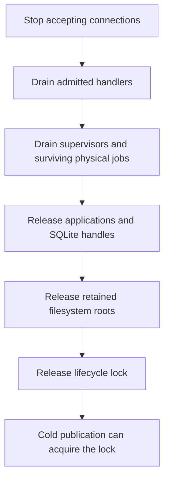

# Why execution outlives a connection

A caller can stop waiting while its operation is still committing to storage or waiting for a
receiver. The service must keep that work accounted for until it actually ends. Otherwise a lost
response could free the worker for overlapping execution. It could also make the service report a
refusal while admission is still committing.

The [service contract](../reference/service.md#version-1-socket-contract) defines response meanings
and caller actions. This page explains the runtime choices behind them.

## Admission under contention

A submission has two separate events: the service commits admission, then the caller receives its
acknowledgement. The first can happen without the second. A competing submission must therefore
check retained admission before reporting that the worker is busy.

A stored read and a worker check happen at different times. Suppose the competing submission checks
only the current worker, without keeping a reference to the original job:

| Step | Original submission for ID A         | Competing submission for ID A                |
| ---- | ------------------------------------ | -------------------------------------------- |
| 1    | Starts work before admission commits | Cannot acquire the execution permit          |
| 2    | Still committing                     | Reads a snapshot with no retained A          |
| 3    | Commits admission, then finishes     | Has not yet checked current worker ownership |
| 4    | No longer running                    | Finds no current worker                      |

The competing submission saw neither the committed row nor a running worker. That does not mean A
was refused. Both checks were accurate when taken. Combining them into a refusal would be wrong.

The runtime holds a reference to the original selection before reading. That reference is the
**ownership pin**: it identifies the selected job and keeps its execution permit held through the
probe's decision. Ownership is published before work starts. The probe checks current ownership
again after the read, but cannot forget the original matching job.

There is also a race before the pin is acquired: the original job can retire, and a matching
successor can commit and retire too. If the probe cannot pin the original job, an absence read stays
`INDETERMINATE`, even when no matching job is visible afterward. If the lookup confirms admission,
the service reports it. If the lookup fails, it reports the access error. Neither result depends on
whether a worker is still running. The read-only lookup cannot settle another job's pending commit
or create a second execution task.

The exact permit-acquisition and pinning rules live beside
[`admit_submission`](../../crates/kapsel-daemon/src/server/runtime.rs). Its regressions cover both
completion during a pinned read and a matching successor that comes and goes before a pinless probe
decides:

- `same_id_completion_during_absence_probe_retains_original_generation`;
- `pinless_absence_probe_cannot_refuse_a_completed_matching_successor`.

## Physical jobs and retirement

The response supervisor waits for work and delivers its response. The blocking closure performs the
synchronous storage work. Cancelling the supervisor does not stop a closure already running.

The [job registry](../../crates/kapsel-daemon/src/server/runtime/jobs.rs) makes both retain the same
lease. The lease holds the connection permit and, for execution, the selected job's execution
permit. The registry records a job before starting it and tracks at most eight jobs. It removes a
completed record only after supervisor completion and final lease retirement.

This also determines shutdown order:

The reactor must keep running while jobs drain because a blocking job can still need its I/O and
timers. Destroying the runtime is not a substitute for waiting. The outer runtime `block_on` drives
this drain. `Handle::block_on` on its own cannot drive a current-thread runtime's I/O and timers.

SIGTERM, finite serving completion and a recoverable accept error use this retirement path. A stuck
fsync can leave it incomplete indefinitely. Cold publication uses the nonwaiting lifecycle lock: it
refuses contention rather than replacing configuration while old work survives.

`supervisor_abort_keeps_permits_until_blocking_work_retires` in the job registry tests holds a
physical job after aborting its supervisor. It checks that both permits remain unavailable until the
job is released. A response timeout alone would not show that the permits stay held.

Lifecycle exclusion must also survive supervisor retirement while physical work remains. In
[`retirement_tests.rs`](../../crates/kapsel-daemon/src/server/runtime/retirement_tests.rs),
`sigterm_retains_blocked_storage_and_lease_until_ordered_retirement` holds storage work across
SIGTERM. It checks that the listener closes while the application and lifecycle lock remain held.
Only releasing the work allows the application to retire and another process to acquire the lock.
Shutdown tests must check lifecycle exclusion as well as permit retention.

[Linux process tests](qualification.md#kapsel-service-candidate) add disconnect and process-loss
evidence. Neither runtime tests nor process exits establish power-loss durability or a deadline for
stalled storage.
