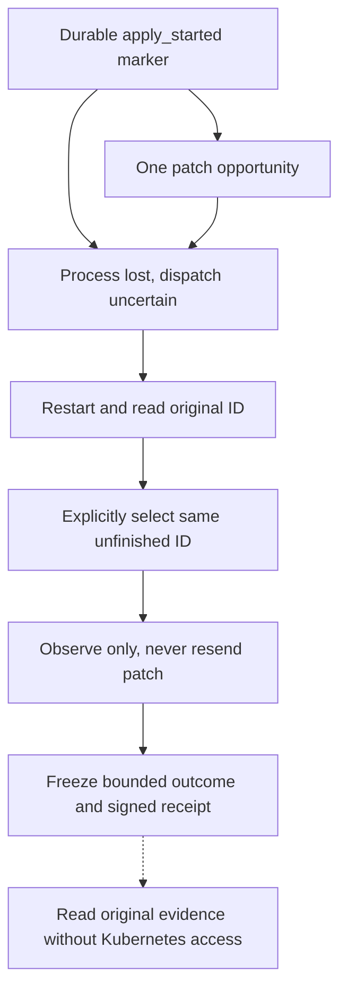

# Kapsel service operator guide

Use this guide to install the Linux service, prepare Kubernetes approvals, publish configuration,
and repair blocked work. The operator supplies authority and private execution material. The caller
selects approved IDs.

## Choose a procedure

- First fixture operation: [Getting started](../getting_started.md).
- Your own installation: [Prepare the extracted artifact](#prepare-your-own-extracted-artifact).
- Kubernetes authority: [Provision an approval](#provision-authority-and-an-exact-approval).
- Git authority: [Git preparation](git_transition.md#operator-preparation).
- Configuration or binary replacement: [Stop and replace](#stop-replace-or-remove-executables).
- Blocked work: [Diagnose and resume](#diagnose-and-resume).
- Caller integration: [Caller guide](caller.md).

Use a fresh disposable host and authenticated artifacts. Kapsel is a non-production developer
release. The [service reference](../reference/service.md) defines exact paths, identities, and
lifecycle.

## Artifact requirements

[Authenticate and extract the release](../reference/release.md#authenticate-and-extract-the-release)
before running it. Keep the complete matching archive and sidecars. Never substitute a verifier from
another build. Identify artifacts by source revision and SHA-256, not package version alone. Local
builds need their own qualification.

## Prepare your own extracted artifact

The following steps are for operator-owned authority and a real receiver, not the disposable example
above.

Use one fresh, disposable native x86-64 Debian 12 host with systemd, Python 3.11, OpenSSL, sudo and
standard account tools. Artifact preparation additionally requires Cosign 3.1.2 and GNU `sha256sum`.
Follow
[Authenticate and extract the release](../reference/release.md#authenticate-and-extract-the-release)
using its checksum-bound verifier companion and Python 3.11 or newer. An unsigned local test archive
is not authenticated publication. No Rust toolchain or repository checkout is needed on the
operating host.

Do not use these fresh-host commands on a machine with experimental service identities, private
roots, installer records, an existing unit or installed Kapsel binaries. Inventory those first under
[existing-host precautions](../reference/service.md#existing-host-state). A matching name is not
permission to adopt, overwrite, chown or remove an object.

In a trusted root operator shell, set `artifact` to the absolute extracted directory. Confirm the
identities and destinations below are absent, including dangling symlinks, before proceeding:

```sh
artifact=/absolute/path/to/kapsel-0.3.0-x86_64-unknown-linux-gnu
# Inspect first. Unexpected existing entries mean stop, not automatic reuse.
getent passwd kapsel kapsel-service-caller
getent group kapsel kapsel-service-callers
ls -ld /etc/kapsel /var/lib/kapsel /run/kapsel /usr/libexec/kapsel \
  /usr/bin/kapsel /usr/bin/kapsel-service-client \
  /usr/share/kapsel /usr/share/doc/kapsel \
  /usr/lib/systemd/system/kapseld.service /usr/lib/sysusers.d/kapseld.conf
```

After confirming this is a fresh host, install the exact extracted assets:

```sh
install -d -m 0755 /usr/libexec/kapsel /usr/share/kapsel /usr/share/doc/kapsel
install -m 0755 "$artifact/bin/kapsel" /usr/bin/kapsel
install -m 0755 "$artifact/bin/kapsel-service-client" /usr/bin/kapsel-service-client
install -m 0755 "$artifact/libexec/kapsel/kapseld" /usr/libexec/kapsel/kapseld
install -m 0644 "$artifact/share/kapsel/kapseld.service" /usr/lib/systemd/system/kapseld.service
install -m 0644 "$artifact/share/kapsel/kapseld.conf" /usr/lib/sysusers.d/kapseld.conf
install -m 0644 "$artifact/share/kapsel/kapseld-rbac.yaml" /usr/share/kapsel/kapseld-rbac.yaml
install -m 0644 "$artifact/share/doc/kapsel/"*.md /usr/share/doc/kapsel/
systemd-sysusers /usr/lib/sysusers.d/kapseld.conf
useradd --system --no-create-home --gid kapsel-service-callers \
  --shell /usr/sbin/nologin kapsel-service-caller
install -d -o kapsel -g kapsel-service-callers -m 0700 /etc/kapsel /var/lib/kapsel
systemctl daemon-reload
```

The service identity and caller identity must be different. Do not grant the caller sudo, Docker,
private-file access, Kubernetes credentials, the service UID, or a way to become the operator. The
unit uses the caller group for socket access, but mode `0700` keeps private roots inaccessible.
Systemd creates `/run/kapsel` with mode `0750` on start and removes it on stop. It retains the state
directory. Do not run `systemctl clean`, delete locks or use private-state deletion as uninstall.

## Provision authority and an exact approval

The supplied RBAC asset is a concrete example for the existing `demo/agent-api` Deployment only. It
creates a token-automount-disabled ServiceAccount and namespaced `get`/`patch` authority for that
Deployment. The cluster operator must approve and apply it using their own tools. It does not create
a namespace, workload or credential. If the target differs, explicitly review the equivalent narrow
RBAC. Do not use cluster-admin credentials. Resolve desired-state ownership with any existing
reconciler before approving direct mutation. This is not a GitOps integration.

Before preparing or publishing approvals, apply the service's
[action-independence rule](../reference/service.md#action-independence) against selectable actions
and unresolved history. Keep conflicting follow-on approvals unavailable. A free worker or terminal
`UNKNOWN` does not clear a conflict. The service validates authority and lifecycle mechanics but
does not infer whether two application changes are independent.

In a private operator workspace, provision these inputs using your cluster and key-management tools:

- `kubeconfig.yaml`: explicit context, endpoint and embedded CA/credential data. No exec plugin,
  credential-file reference or ambient fallback. Issue bounded credentials and record their expiry.
- `approval.seed` and `approval.pub`: the operator's 32-byte raw Ed25519 signing seed and matching
  public key. Appoint the public key independently. Never derive trust from a grant.
- `receipt.seed`: a separate intended 32-byte raw Ed25519 receipt seed. Retain `receipt.pub` and
  separately appointed `receipt.trust` for later inspection. The disposable generation example below
  creates these files without fixed test seeds.
- `authorization.json`: the exact intent below. Replace the example image with your approved digest
  and use a new operation ID for each genuinely new approval.

Keep this workspace mode `0700` and private inputs mode `0600`. Do not give the approval seed to the
service. The service only needs its public appointment and signed grants.

### Canonical Deployment-image example

The example throughout this guide is `demo/agent-api`, container `api`, operation `artifact-op-1`.
The fixture uses this small Deployment with a synthetic starting image. It supplies UID and
resourceVersion as receiver facts, not fields for the caller to invent:

<!-- example-deployment -->

```json
{
  "apiVersion": "apps/v1",
  "kind": "Deployment",
  "metadata": { "namespace": "demo", "name": "agent-api" },
  "spec": {
    "replicas": 1,
    "selector": { "matchLabels": { "app": "agent-api" } },
    "template": {
      "metadata": { "labels": { "app": "agent-api" } },
      "spec": {
        "containers": [
          {
            "name": "api",
            "image": "registry.example/kapsel/agent-api@sha256:aaaaaaaaaaaaaaaaaaaaaaaaaaaaaaaaaaaaaaaaaaaaaaaaaaaaaaaaaaaaaaaa"
          }
        ]
      }
    }
  }
}
```

For a real disposable cluster, the cluster operator must create namespace `demo`, replace that image
with a real approved starting digest, and apply the Deployment using their own cluster tools. Wait
for the starting rollout to settle before snapshot approval. The synthetic registry and digests in
this fixture are not downloadable images. Creating the workload is separate from Kapsel's one image
change. Never apply this fixture manifest unchanged to a real cluster.

Save this readable intent as `authorization.json`. For a real receiver, replace the desired image
with your approved digest. Use the ID only for this approval:

<!-- example-authorization -->

```json
{
  "authorization_id": "approval-1",
  "operation_id": "artifact-op-1",
  "namespace": "demo",
  "deployment": "agent-api",
  "container": "api",
  "immutable_image_digest": "registry.example/kapsel/agent-api@sha256:0123456789abcdef0123456789abcdef0123456789abcdef0123456789abcdef"
}
```

The fields identify the operator's approval, its stable action ID and the one exact image change.
There are no credentials, private paths or arbitrary patch fields. Service callers subsequently
select only `artifact-op-1`, not this JSON document.

### Generate disposable keys and inspection trust

Run in a new private workspace, mode `0700`, with Python 3.11+ and OpenSSL 3. These are freshly
random local keys, not production key-management advice. The approval seed stays with the operator.
The service receives only its public appointment and signed approval, plus the **separate** receipt
seed. The public receipt key is appointed here before any receipt exists.

The Python block uses OpenSSL to derive public keys from random Ed25519 seeds. It checks the exact
RFC 8410 public-key encoding before extracting the raw 32 bytes Kapsel requires. It creates files
exclusively, so an existing key or trust file stops the example rather than being replaced. On a
partial failure, inspect and use a new workspace. Do not rerun over existing authority.

<!-- example-keys -->

```sh
umask 077
python3 - <<'PY'
import os
import pathlib
import subprocess
import time

os.umask(0o077)
for name in ("approval", "receipt"):
    seed = os.urandom(32)
    encoded = subprocess.run(
        ["openssl", "pkey", "-inform", "DER", "-pubout", "-outform", "DER"],
        input=bytes.fromhex("302e020100300506032b657004220420") + seed,
        capture_output=True, check=True, timeout=10,
    ).stdout
    prefix = bytes.fromhex("302a300506032b6570032100")
    if len(encoded) != len(prefix) + 32 or not encoded.startswith(prefix):
        raise RuntimeError("unexpected Ed25519 public-key encoding")
    for suffix, data in (("seed", seed), ("pub", encoded[len(prefix):])):
        with open(f"{name}.{suffix}", "xb") as output:
            output.write(data)

# Explicit disposable inspection appointment, valid for this next hour only.
evaluation_time = int(time.time())
fields = [
    b"receipt-key-1", pathlib.Path("receipt.pub").read_bytes(),
    b"kapsel.kap0038.kubernetes-effect-receipt.v3",
    evaluation_time.to_bytes(8, "big", signed=True),
    (evaluation_time + 3600).to_bytes(8, "big", signed=True),
]
trust = b"KAPSEL-KAP0038-K8S-TRUST-V2\0" + b"".join(
    bytes([number]) + len(value).to_bytes(4, "big") + value
    for number, value in enumerate(fields, 1)
)
with open("receipt.trust", "xb") as output:
    output.write(trust)
with open("evaluation-time.txt", "x") as output:
    output.write(str(evaluation_time) + "\n")
print("Created separate disposable approval and receipt keys plus receipt.trust")
PY
```

The recorded time is an explicit trust-evaluation input, not a receipt timestamp or proof of when
Kubernetes changed. The [receipt contract](../reference/evidence_formats.md#receipt-and-inspection)
defines trust framing and explains how evaluation time is used. The fixture's separate fixed-time
trust is not the appointment above.

### Read the snapshot, sign and assemble configuration

From that private workspace in the root operator shell, with `kubeconfig.yaml` already provisioned:

<!-- example-prepare -->

```sh
umask 077
/usr/bin/kapsel provision-snapshot-grant \
  --authorization authorization.json --kubeconfig kubeconfig.yaml \
  --signing-seed approval.seed --signing-key-id approval-key-1 --output approval.grant &&
/usr/bin/kapsel prepare-service-config \
  --authorization-key approval-key-1 approval.pub \
  --approval 'Approved image for agent-api' approval.grant \
  --receipt-signing-key-id receipt-key-1 --output operator.candidate.json
```

`provision-snapshot-grant` performs the authenticated receiver read itself. It signs that UID and
resourceVersion along with the intent. A separate `kubectl get` is not a substitute for this read.
Neither command changes the Deployment or publishes the service document.

Inspect the actual assembled version-1 document locally:

```sh
python3 -m json.tool operator.candidate.json
```

Its `service_configuration_version` is `1`. `authorization_keys` appoints `approval-key-1` with
`approval.pub` encoded as hex. `approvals` contains the display label and the real signed
`approval.grant` encoded as hex. `receipt_signing_key_id` is `receipt-key-1`, a public identity, not
the receipt seed. Hex is transport encoding, not something to edit or copy from this guide. The
readable intent above explains what the grant authorizes. The document contains no configurable
paths or cluster credentials. The
[exact schema](../reference/service.md#versioned-operator-document) defines its bounds. Keep the
actual generated document private instead of publishing reusable approval bytes.

After successful preparation, install execution material and cold-publish the candidate:

```sh
install -o kapsel -g kapsel-service-callers -m 0600 kubeconfig.yaml /etc/kapsel/kubeconfig.yaml
install -o kapsel -g kapsel-service-callers -m 0600 receipt.seed /etc/kapsel/receipt.seed
runuser -u kapsel -g kapsel-service-callers -- \
  /usr/libexec/kapsel/kapseld --replace-operator-config < operator.candidate.json
```

Preparation validates document structure, separate trust appointments and snapshot grant
authentication before creating the new private candidate. There is no need to validate that
unchanged output again. Cold replacement separately checks custody and compatibility with retained
history before publication.

For a configuration you edited or received from elsewhere, validate it independently:

```sh
/usr/bin/kapsel validate-service-config --operator-config operator.candidate.json
```

`VALIDATED_STATIC` confirms those same static checks. It does not open history, contact Kubernetes,
check credentials or prove host readiness.

Proceed only after `PUBLISHED` and exit `0`. A missing or uncertain response requires inspection,
not automatic replay. No token or key is bundled in the archive. The service requires snapshot
grants and journal format 6. Preserve refused history unchanged. See
[preserve operation history](journal_retention.md).

Start explicitly, then read before selecting anything:

```sh
systemctl start kapseld.service
systemctl show kapseld.service -p ActiveState -p SubState -p ExecMainStatus
sudo -u kapsel-service-caller -g kapsel-service-callers -- /usr/bin/kapsel-service-client history
```

`Type=exec` start success means execution began, not that history is ready or an action succeeded.
If the client is unavailable, inspect the unit and diagnostics below. No action is selected at
startup. The unit does not automatically restart or enable itself at boot.

Credential renewal is explicit operator work. Stop gracefully, replace only the intended credential
material under the same custody, and start to reload it. Read the original ID before explicit
resumption. Expired credentials do not justify reapproval, a new ID or a receiver outcome.

The fixed `/etc/kapsel/operator.json` uses the
[versioned service document](../reference/service.md#versioned-operator-document). It supplies
bounded snapshot approvals and external public-key appointments. Each approved ID and tuple is
immutable. Reapproval requires an operator decision, a new grant, and a new action ID. Restart must
not refresh an existing action's authority.

## Stop, replace or remove executables

Run `systemctl stop kapseld.service` and wait for it to finish before replacing configuration,
credentials or executables. Confirm `ActiveState=inactive` and `MainPID=0` with `systemctl show`. A
timeout, lost shell or forced kill is not successful retirement. Preserve the history and follow the
uncertainty guidance below.

Kapsel supplies no cross-version replacement procedure. For an independently assessed executable
replacement, authenticate and verify the new archive first. While stopped, replace only the
installed binaries/unit/docs with their exact new bytes, retaining the service UID/GID, roots,
journal, sidecars, lifecycle lock, original grants and historical trust. Reload the unit, start, and
read history first. This is not authorization to use an older binary or migrate a refused journal.
Older formats are refused unchanged. A fresh installation cannot recover continuity for an old or
lost journal.

For removal, stop and disable the unit. An operator may remove only the installed executables and
static assets whose provenance they have verified, then run `systemctl daemon-reload`. Retain
`/etc/kapsel`, `/var/lib/kapsel`, identities, original authority and any exported receipts under
private custody. Do not run `systemctl clean`, recursively delete roots, or recycle identities.
There is no automated cleanup, state migration or backup recovery promise. Never restore stale state
to revive execution: the host may already have sent a mutation absent from that snapshot.

### Replace the cold operator document

Stop the daemon gracefully, then run exactly `/usr/libexec/kapsel/kapseld --replace-operator-config`
under the existing service UID/effective GID, feeding the complete candidate on stdin (at most 160
KiB). This is trusted operator provisioning, not a caller command. It changes only fixed
`/etc/kapsel/operator.json`. It never starts the daemon or advances an action. The daemon and
publisher share a nonwaiting lifecycle lock. Do not delete that lock to bypass contention. Do not
replace private roots or launch old binaries ignoring it.

The
[canonical publication contract](../reference/service.md#cold-publication-and-graceful-retirement)
defines validation, custody and outcomes:

- `PUBLISHED` with exit `0` confirms rename and directory sync.
- `NOT_PUBLISHED` with exit `4` proves refusal before rename.
- `INDETERMINATE` with exit `5` requires inspection.

Stdout contains just that bounded status line. A rename error, failed output, lost response or crash
is not proof of non-publication. Never automatically roll back or replay after an uncertain result.
Inspect the fixed document and journal before deciding the next operator action.

Validation is strictly read-only/no-create against retained history, including schema and capacity.
Recovery-required journals must first undergo ordinary recovery, not publication-side repair. Lost
journal history plus leftover sidecars or a worker lock is rejected rather than treated as fresh.
Catalog removal does not erase history or change original receipts. Omitting an original historical
key makes that ID inaccessible until its external trust is restored. It does not replace authority.

SIGTERM stops acceptance and drains surviving work. Systemd has `TimeoutStopSec=infinity`: hung
storage can leave stop incomplete and publication excluded indefinitely. Manual SIGKILL is a crash,
not successful retirement. After a completed publication, start normally and read history/status
first. Startup does not reconcile automatically.

## Submit and inspect

With the service already provisioned and running, list the approved handles and read retained
history before selecting an ID. These example IDs are placeholders, not authority:

```sh
operation_id=artifact-op-1
sudo -u kapsel-service-caller -g kapsel-service-callers -- \
  /usr/bin/kapsel-service-client list
sudo -u kapsel-service-caller -g kapsel-service-callers -- \
  /usr/bin/kapsel-service-client history
sudo -u kapsel-service-caller -g kapsel-service-callers -- \
  /usr/bin/kapsel-service-client submit "$operation_id"
sudo -u kapsel-service-caller -g kapsel-service-callers -- \
  /usr/bin/kapsel-service-client status "$operation_id"
```

For an agent that speaks MCP, provision the
[ID-only stdio bridge](../reference/mcp.md#resident-service-bridge) with
`command: "/usr/bin/kapsel-service-mcp"` and `args: []` in its trusted launch configuration. Launch
the bridge as the same confined caller UID/effective GID. Do not put the operator document, socket
path, credentials or receipt export path into tool input.

The caller account's primary group is `kapsel-service-callers`. The explicit `-g` supplies the
required effective GID without a supplementary membership entry. Every response has integer
`version: 1`. `ADMITTED` includes the confirmed durable phase, not worker liveness or receiver
success. `NOT_ADMITTED` with `BUSY` or `CAPACITY` is a definite refusal of new work.
`INDETERMINATE`, an error, timeout or disconnect is not proof of non-admission. Read the same ID. Do
not invent a replacement action. `list` and `history` accept an optional `after-id` cursor.

| Status          | Next interpretation                                                                                                                               |
| --------------- | ------------------------------------------------------------------------------------------------------------------------------------------------- |
| `NOT_FOUND`     | No durable action is visible. This is not proof that an accepted background task cannot still start.                                              |
| `IN_PROGRESS`   | Follow `execution.next_action`. Durable unfinished history does not prove a worker is running.                                                    |
| `NOT_ATTEMPTED` | Inspect `target_rejection`. `STALE_APPROVAL` requires an operator decision about new approval, not automatic refresh. There is no effect receipt. |
| `SUCCEEDED`     | Inspect application behavior. Deployment availability is not application correctness.                                                             |
| `FAILED`        | Investigate the defined receiver failure. No automatic rollback is authorized.                                                                    |
| `UNKNOWN`       | Stop dependent mutations and hand the original evidence to an operator. It is not retry permission.                                               |

For an attempted action with a ready receipt, export its exact stored bytes to a new caller-owned
file and inspect them under separately supplied trust:

```sh
receipt="/tmp/$operation_id.receipt"
sudo -u kapsel-service-caller -g kapsel-service-callers -- \
  /usr/bin/kapsel-service-client receipt "$operation_id" "$receipt"
# In the operator workspace above, read the explicitly recorded evaluation time.
read -r evaluation_time_unix_s < evaluation-time.txt
sudo /usr/bin/kapsel inspect \
  --receipt "$receipt" \
  --trust receipt.trust \
  --evaluation-time-unix-s "$evaluation_time_unix_s"
```

The trust file and evaluation time are operator-selected. Inspection reports `INSPECTED`, never
`VERIFIED`. The service reads canonical bytes from SQLite. An unavailable output destination or
existing file fails export without changing the action. Use a new writable destination for a later
export. The service needs no receipt directory and the caller never opens its private journal.

## Diagnose and resume

An absent row is `NOT_FOUND` with `execution.disposition: "admission_unconfirmed"`. This read cannot
prove non-admission while a commit may still finish. Only a submission response of `NOT_ADMITTED`
confirms definite refusal. Continue reading the same ID after uncertainty.

For unfinished history, use `execution`, not internal phase names:

- `active`: wait. The physical job may be blocked, so this is not a progress guarantee.
- `waiting_for_worker`: wait, then explicitly submit the same ID. There is no queue.
- `resume_required`: explicitly submit the same ID. A null condition means the process does not know
  why it stopped. Do not infer a crash. A repeated `preflight_unavailable` warrants operator
  inspection.
- `operator_required`: obtain remediation below, then explicitly submit the same ID.

Any authenticated service caller may resume an original retained snapshot-approved ID. The gateway
still checks original authority and controls continuation. Reselecting after attempt cannot resend
the PATCH. Signing completion cannot acquire new observations. Do not create a replacement ID just
because execution stopped or a response was lost.

Client failures print fixed local codes on stderr. `connection_unavailable` means the operator
should check service state and caller access. `exchange_incomplete` or `response_invalid` after
submission requires reading the same ID, not automatic resubmission with a new ID.
`receipt_unavailable` means read status first. `export_failed` means inspect the caller-owned output
destination and choose a new writable path. `output_unavailable` means restore stdout and read the
original ID after uncertainty. These are not receiver outcomes. `--help` lists the grammar and
`--version` identifies each binary without requiring a running service.

Operators can inspect the existing process fields with `systemctl show kapseld.service` and fixed
codes with `journalctl -u kapseld.service`. Keep journal access operator-only. Read failures emit at
most once per class per service lifetime, not once per poll or identity. Diagnostics may be lost
under backpressure or process loss. Missing or repeated codes are not progress evidence. The daemon
uses nonblocking pipe/socket stderr only, as supplied by the unit. Do not redirect it to a regular
file or clear its nonblocking flag. Status and process exit remain usable when diagnostics are lost.
Do not paste private configuration, grant bytes, credentials or signing seeds into diagnostics or
caller responses.

| Code                                                | Operator action                                                                                                                                                          |
| --------------------------------------------------- | ------------------------------------------------------------------------------------------------------------------------------------------------------------------------ |
| `provisioning_unavailable`                          | Inspect fixed roots, file ownership/modes, lifecycle exclusion and operator document bounds. Preserve unknown artifacts.                                                 |
| `configuration_invalid`                             | Validate the version-1 operator document and separately appointed original grant keys. Use cold replacement, never caller input.                                         |
| `original_authority_unavailable`                    | Restore the original externally appointed trust key for the retained grant. Do not replace authority under the same ID.                                                  |
| `storage_or_operation_blocked`, `operation_blocked` | Inspect journal version, custody, filesystem availability and retained history using the owning binary. Do not delete, rotate or restore stale history as a retry.       |
| `storage_history_missing`                           | Stop. Retained artifacts survive without their database. Preserve all artifacts; do not initialize replacement history.                                                  |
| `storage_history_invalid`                           | Stop. History is malformed, corrupt or unsupported. Preserve exact bytes and use the matching binary; do not edit versions or rows.                                      |
| `storage_unavailable`                               | Inspect filesystem space, inodes, access and I/O health. A failed write does not establish non-admission or receiver outcome.                                            |
| `preflight_unavailable`                             | Check receiver connectivity, narrow RBAC and credential validity. The code does not distinguish these from bounded/malformed response failure.                           |
| `receiver_unavailable`                              | Repair the fixed kubeconfig or receiver access. Execution snapshots are loaded at startup, so changed material needs graceful stop/start. Read before same-ID selection. |
| `signing_unavailable`                               | Restore the intended private receipt seed and valid configured signer ID. Restart to reload material, then select the same ID to complete frozen facts.                  |
| `completion_blocked`                                | Check storage capacity/custody and signing configuration. Preserve frozen observations and original receipts. Resume the same ID only after remediation.                 |
| `worker_contention`                                 | Let the current owner retire. Then select the same ID explicitly. Never remove a lock to bypass exclusion.                                                               |
| `internal_failure`                                  | Preserve history and inspect the binary/host before restart. No exception payload or secret-bearing detail is logged.                                                    |

Codes describe observations in the current process, not a durable audit trail or proof of root
cause. Status is still readable when execution material is unavailable. Unsafe or unreadable
authority and storage may prevent startup. The journal retains at most **504 identities and 32
unfinished actions**. There is no pruning. Clearing history to make room or resume would destroy the
no-resend boundary.

### Storage refusal and repair

The catalog accepts at most 32 selectable approvals. An oversized catalog is invalid configuration,
not journal exhaustion. Catalog withdrawal never removes retained history or releases its capacity.
`NOT_ADMITTED / CAPACITY` refuses new work at 504 retained or 32 unfinished identities. Reads and
identical-ID selection remain available wherever stored state permits. Completing unfinished work
releases only an unfinished slot. Exporting receipts releases neither limit.

For `storage_unavailable` or `completion_blocked`, run these read-only checks in an operator shell:

```sh
systemctl show kapseld.service -p ActiveState -p SubState -p MainPID -p ExecMainStatus
journalctl -u kapseld.service --no-pager -n 50
df -h /var/lib/kapsel
df -i /var/lib/kapsel
```

Free bytes do not prove writable storage: inode exhaustion, custody failures and I/O errors remain
possible. Private-root checks can report `provisioning_unavailable` before the journal opens. Do not
paste private files or raw errors into caller output. No diagnostic proves a receiver result or
shows that a possibly committed admission failed.

1. Request `systemctl stop kapseld.service`. Wait for `ActiveState=inactive` and `MainPID=0` before
   changing storage or material. A blocked stop is incomplete. Do not bypass lifecycle exclusion.
2. Repair only the diagnosed availability problem under operator authorization. For exhaustion,
   release unrelated storage, never Kapsel history, locks, SQLite sidecars or original authority.
3. Start the service. Read `history` and `status` for the original ID with the
   [fixed client commands](#submit-and-inspect). Startup never selects work.
4. Follow execution guidance. Explicit same-ID submission completes frozen observations without
   receiver I/O, or observes attempted history without another mutation. A committed receipt remains
   byte-identical. An absent row after uncertain admission still requires operator investigation.

**Stop repair** if history is missing, invalid, unsupported or cannot be authenticated. Preserve the
journal and sidecars together. Do not discard a rollback journal to make opening succeed. A receipt
export cannot restore no-resend history. Never restore stale state, edit rows or format markers,
create replacement history, raise limits or mint another ID to make uncertain work runnable. If all
artifacts were lost, the service cannot distinguish that loss from a fresh install. Operator custody
must preserve continuity. A successful empty startup cannot confirm it.

The [commit-alternative table](../reference/storage.md#storage-failure-and-commit-alternatives)
separates unconfirmed admission, unfinished completion, and original receipt retrieval. A successful
repair of storage availability does not establish disk-backed power-loss durability or host-loss
continuity.

### Recover access to original evidence

`authority_unavailable` is not `NOT_FOUND`. The journal can retain an action while the operator's
external appointment of its original grant key is missing. `history` keeps that ID visible without
exposing unauthenticated action facts. Receipt export and submission remain blocked for that ID.

Stop gracefully and inspect the original operator-held public-key appointment. If that exact
appointment remains available and its restoration is authorized, prepare a complete candidate
containing it, then use [cold replacement](#replace-the-cold-operator-document). Restart and read
the original ID. Do not generate a replacement key or grant. A completed action needs only its
original trust and healthy storage for receipt retrieval, not receiver credentials or
receipt-signing material. An unfinished action still requires the remediation and explicit same-ID
selection shown by its execution guidance.

If the original authority cannot be established, stop and preserve the journal. Minting another ID,
deleting history or restoring a stale database does not recover the missing authority. Similarly,
`storage_or_operation_blocked` on opening an unsupported journal is a stop-and-inspect condition,
not permission to edit its version or initialize a replacement.

## Disconnect, restart and uncertainty



The diagram follows loss after the attempt marker, not every possible unfinished phase. If status
requires operator remediation, resolve that first. For a resumable unfinished `artifact-op-1`, the
caller sequence is explicit:

```sh
sudo -u kapsel-service-caller -g kapsel-service-callers -- \
  /usr/bin/kapsel-service-client status artifact-op-1
# Only when execution guidance calls for same-ID selection:
sudo -u kapsel-service-caller -g kapsel-service-callers -- \
  /usr/bin/kapsel-service-client submit artifact-op-1
sudo -u kapsel-service-caller -g kapsel-service-callers -- \
  /usr/bin/kapsel-service-client status artifact-op-1
```

This is a recovery procedure, not captured crash-test output. Do not create a crash by killing a
service that owns real work merely to follow the example.

Caller disconnect does not cancel surviving selected work. Service startup exposes authenticated
stored reads without reconciliation, Kubernetes availability, receipt seeds or export access.
Missing, invalid or unsafe execution files disable that material without disabling reads. They do
not trigger ambient configuration or replacement keys. Read status/history first after restart.
Explicit reselection of the same unfinished ID requests one bounded advancement pass. After a
durable attempt, recovery observes without another PATCH, even when loss may have preceded the
original send. A stored receipt remains byte-identical through restart and retrieval. Ordinary
status and receipt reads remain offline: a rollout settling after terminal `UNKNOWN` does not update
the historical result.

Systemd and operator configuration own lifecycle and credentials. A stopped daemon makes the socket
unavailable. Already exported receipts remain inspectable offline. Database loss can prevent
retrieval, and losing or rolling back action history defeats continuity assumptions. No automatic
backup, HA, credential renewal, installer recovery or destructive cleanup is supplied by this guide.

## Example: restore a missing receipt signer

This captured fixture transcript shows completion after signing material is restored. It is not a
live Kubernetes rollout. Do not withhold material or kill a service that owns real work merely to
reproduce a failure. The
[qualification procedure](../contributing/qualification.md#documented-operator-example) checks these
blocks against the production binaries.

After the preparation steps above, `list` shows `artifact-op-1` and initial `history` is empty.
Submission returns:

<!-- example-admitted -->

```json
{ "version": 1, "status": "ADMITTED", "phase": "requested" }
```

After one PATCH and frozen rollout observations, status remains `IN_PROGRESS` with:

<!-- example-signing -->

```json
{
  "action_owner": "operator",
  "condition": "signing_unavailable",
  "disposition": "operator_required",
  "next_action": "contact_operator"
}
```

The operator stops gracefully, restores the intended `receipt.seed` under its original custody, and
restarts. Reading the same ID before submission returns `IN_PROGRESS` with:

<!-- example-resume -->

```json
{
  "action_owner": "caller",
  "condition": null,
  "disposition": "resume_required",
  "next_action": "select_same_id"
}
```

Restart does not contact the receiver. `submit artifact-op-1` returns:

<!-- example-readmitted -->

```json
{ "version": 1, "status": "ADMITTED", "phase": "receiver_observed" }
```

Status then becomes `SUCCEEDED`, with `execution.next_action: "inspect_result"`. Export returns
`READY` with a SHA-256 and new caller-owned path. Inspection under separately appointed fixture
trust returns `INSPECTED` for `artifact-op-1` with `result: "SUCCEEDED"`.

The fixture counts one PATCH. Restoring the signer completes already frozen evidence without new
receiver requests. Random keys make grant and receipt digests differ between runs.
